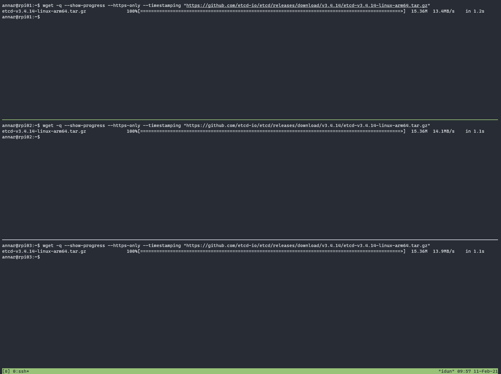

# Prerequisites

## RaspberryPi 4B

This tutorial leverages the [RaspberryPi 4B](https://www.raspberrypi.org/products/raspberry-pi-4-model-b/), rather than the [Google Cloud Platform](https://cloud.google.com/). As such, provisioning resources primarily relies upon [ansible playbooks](https://github.com/joshuaejs/raspberry-pik3s).

## Running Commands in Parallel with tmux

[tmux](https://github.com/tmux/tmux/wiki) can be used to run commands on multiple compute instances at the same time. Labs in this tutorial may require running the same commands across multiple compute instances, in those cases consider using tmux and splitting a window into multiple panes with synchronize-panes enabled to speed up the provisioning process.

> The use of tmux is optional and not required to complete this tutorial.
  _(but *highly* recommended)_

> split window vertically: `ctrl-b` then `"`
> resize panes equally vertically: `ctrl-b` `alt-2` (or `option-2`)
> split window horizontally: `ctrl-b` then `%`
> resize panes equally horizontally: `ctrl-b` `alt-5` (or `option-5`)
> Enable synchronize-panes by pressing `ctrl+b` followed by `shift+:`. Next type `set synchronize-panes on` at the prompt. To disable synchronization: `set synchronize-panes off`.

Next: [Installing the Client Tools](02-client-tools.md)
