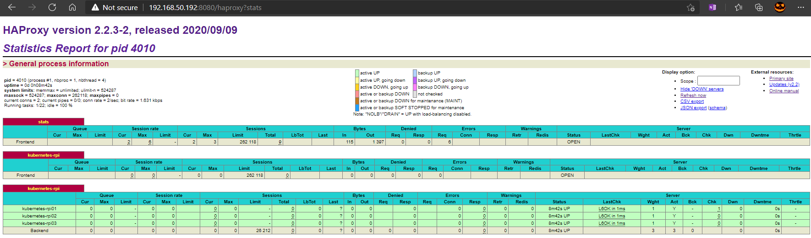

# Bootstrapping the Kubernetes Control Plane

In this lab you will bootstrap the Kubernetes control plane across three RaspberryPi and configure it for high availability. You will also create an *external* load balancer that balances connections to the Kubernetes API Servers from remote clients. The following components will be installed on each node: Kubernetes API Server, Scheduler, and Controller Manager.

## Prerequisites

The commands in this lab must be run on each controller instance: `rpi01`, `rpi02`, and `rpi03`. Login to each controller instance using ssh. Example:

```txt
ssh rpi01
```

### Running commands in parallel with tmux

[tmux](https://github.com/tmux/tmux/wiki) can be used to run commands on multiple compute instances at the same time. See the [Running commands in parallel with tmux](01-prerequisites.md#running-commands-in-parallel-with-tmux) section in the Prerequisites lab.

## Provision the Kubernetes Control Plane

Create the Kubernetes configuration directory:

```txt
sudo mkdir -p /etc/kubernetes/config
```

### Download and Install the Kubernetes Controller Binaries

Download the official Kubernetes release binaries (the *server* package has what we want):

```txt
wget -q --show-progress --https-only --timestamping "https://dl.k8s.io/v1.20.0/kubernetes-server-linux-arm64.tar.gz"
```

Install the Kubernetes binaries:

```txt
tar -zxf kubernetes-server-linux-arm64.tar.gz
sudo mv kubernetes/server/bin/{kube-apiserver,kube-controller-manager,kube-scheduler,kubectl} /usr/local/bin/
```

### Configure the Kubernetes API Server

```txt
sudo mkdir -p /var/lib/kubernetes/

sudo mv ca.pem ca-key.pem kubernetes-key.pem kubernetes.pem \
  service-account-key.pem service-account.pem \
    encryption-config.yaml /var/lib/kubernetes/
```

The instance internal IP address will be used to advertise the API Server to members of the cluster. Retrieve the internal IP address for the current compute instance:

```txt
INTERNAL_IP=$(host $(hostname -s).octopik3s.io | awk '{print $4}')
```

Create the `kube-apiserver.service` systemd unit file:

```txt
cat <<EOF | sudo tee /etc/systemd/system/kube-apiserver.service
[Unit]
Description=Kubernetes API Server
Documentation=https://github.com/kubernetes/kubernetes

[Service]
ExecStart=/usr/local/bin/kube-apiserver \\
  --advertise-address=${INTERNAL_IP} \\
  --allow-privileged=true \\
  --apiserver-count=3 \\
  --audit-log-maxage=30 \\
  --audit-log-maxbackup=3 \\
  --audit-log-maxsize=100 \\
  --audit-log-path=/var/log/audit.log \\
  --authorization-mode=Node,RBAC \\
  --bind-address=0.0.0.0 \\
  --client-ca-file=/var/lib/kubernetes/ca.pem \\
  --enable-admission-plugins=NamespaceLifecycle,NodeRestriction,LimitRanger,ServiceAccount,DefaultStorageClass,ResourceQuota \\
  --etcd-cafile=/var/lib/kubernetes/ca.pem \\
  --etcd-certfile=/var/lib/kubernetes/kubernetes.pem \\
  --etcd-keyfile=/var/lib/kubernetes/kubernetes-key.pem \\
  --etcd-servers=https://192.168.50.193:2379,https://192.168.50.194:2379,https://192.168.50.195:2379 \\
  --event-ttl=1h \\
  --encryption-provider-config=/var/lib/kubernetes/encryption-config.yaml \\
  --kubelet-certificate-authority=/var/lib/kubernetes/ca.pem \\
  --kubelet-client-certificate=/var/lib/kubernetes/kubernetes.pem \\
  --kubelet-client-key=/var/lib/kubernetes/kubernetes-key.pem \\
  --kubelet-https=true \\
  --runtime-config='api/all=true' \\
  --service-account-issuer=api \\
  --service-account-signing-key-file=/var/lib/kubernetes/service-account-key.pem \\
  --service-account-key-file=/var/lib/kubernetes/service-account.pem \\
  --service-cluster-ip-range=10.240.0.0/24 \\
  --service-node-port-range=30000-32767 \\
  --tls-cert-file=/var/lib/kubernetes/kubernetes.pem \\
  --tls-private-key-file=/var/lib/kubernetes/kubernetes-key.pem \\
  --v=2
Restart=on-failure
RestartSec=5

[Install]
WantedBy=multi-user.target
EOF
```

### Configure the Kubernetes Controller Manager

Move the `kube-controller-manager` kubeconfig into place:

```txt
sudo mv kube-controller-manager.kubeconfig /var/lib/kubernetes/
```

Create the `kube-controller-manager.service` systemd unit file:

```txt
cat <<EOF | sudo tee /etc/systemd/system/kube-controller-manager.service
[Unit]
Description=Kubernetes Controller Manager
Documentation=https://github.com/kubernetes/kubernetes

[Service]
ExecStart=/usr/local/bin/kube-controller-manager \\
  --bind-address=0.0.0.0 \\
  --cluster-cidr=10.200.0.0/16 \\
  --cluster-name=kubernetes \\
  --cluster-signing-cert-file=/var/lib/kubernetes/ca.pem \\
  --cluster-signing-key-file=/var/lib/kubernetes/ca-key.pem \\
  --kubeconfig=/var/lib/kubernetes/kube-controller-manager.kubeconfig \\
  --leader-elect=true \\
  --root-ca-file=/var/lib/kubernetes/ca.pem \\
  --service-account-private-key-file=/var/lib/kubernetes/service-account-key.pem \\
  --service-cluster-ip-range=10.240.0.0/24 \\
  --use-service-account-credentials=true \\
  --v=2
Restart=on-failure
RestartSec=5

[Install]
WantedBy=multi-user.target
EOF
```

### Configure the Kubernetes Scheduler

Move the `kube-scheduler` kubeconfig into place:

```txt
sudo mv kube-scheduler.kubeconfig /var/lib/kubernetes/
```

Create the `kube-scheduler.yaml` configuration file:
*note*: the apiVersion for kubescheduler must be updated to `v1beta1`, this will be going away in 1.23

```txt
cat <<EOF | sudo tee /etc/kubernetes/config/kube-scheduler.yaml
apiVersion: kubescheduler.config.k8s.io/v1beta1
kind: KubeSchedulerConfiguration
clientConnection:
  kubeconfig: "/var/lib/kubernetes/kube-scheduler.kubeconfig"
leaderElection:
  leaderElect: true
EOF
```

Create the `kube-scheduler.service` systemd unit file:

```txt
cat <<EOF | sudo tee /etc/systemd/system/kube-scheduler.service
[Unit]
Description=Kubernetes Scheduler
Documentation=https://github.com/kubernetes/kubernetes

[Service]
ExecStart=/usr/local/bin/kube-scheduler \\
  --leader-elect=true \\
  --config=/etc/kubernetes/config/kube-scheduler.yaml \\
  --v=2
Restart=on-failure
RestartSec=5

[Install]
WantedBy=multi-user.target
EOF
```

### Start the Controller Services

```txt
sudo systemctl daemon-reload
sudo systemctl enable kube-apiserver kube-controller-manager kube-scheduler
sudo systemctl start kube-apiserver kube-controller-manager kube-scheduler
```

> Allow up to 10 seconds for the Kubernetes API Server to fully initialize.

### Enable HTTP Health Checks


### Verification

On each controller:

```txt
$ kubectl get componentstatuses --kubeconfig admin.kubeconfig

Warning: v1 ComponentStatus is deprecated in v1.19+
NAME                 STATUS    MESSAGE             ERROR
controller-manager   Healthy   ok
scheduler            Healthy   ok
etcd-1               Healthy   {"health":"true"}
etcd-2               Healthy   {"health":"true"}
etcd-0               Healthy   {"health":"true"}
```

## RBAC for Kubelet Authorization

In this section you will configure RBAC permissions to allow the Kubernetes API Server to access the Kubelet API on each worker node. Access to the Kubelet API is required for retrieving metrics, logs, and executing commands in pods.

> This tutorial sets the Kubelet `--authorization-mode` flag to `Webhook`. Webhook mode uses the [SubjectAccessReview](https://kubernetes.io/docs/admin/authorization/#checking-api-access) API to determine authorization.

The commands in this section will effect the entire cluster and only need to be run once from one of the controller nodes.

```txt
ssh rpi01
```

Create the `system:kube-apiserver-to-kubelet` [ClusterRole](https://kubernetes.io/docs/admin/authorization/rbac/#role-and-clusterrole) with permissions to access the Kubelet API and perform most common tasks associated with managing pods:
*apiVersion has been updated to v1*

```txt
cat <<EOF | kubectl apply --kubeconfig admin.kubeconfig -f -
apiVersion: rbac.authorization.k8s.io/v1
kind: ClusterRole
metadata:
  annotations:
    rbac.authorization.kubernetes.io/autoupdate: "true"
  labels:
    kubernetes.io/bootstrapping: rbac-defaults
  name: system:kube-apiserver-to-kubelet
rules:
  - apiGroups:
      - ""
    resources:
      - nodes/proxy
      - nodes/stats
      - nodes/log
      - nodes/spec
      - nodes/metrics
    verbs:
      - "*"
EOF
```

The Kubernetes API Server authenticates to the Kubelet as the `kubernetes` user using the client certificate as defined by the `--kubelet-client-certificate` flag.

Bind the `system:kube-apiserver-to-kubelet` ClusterRole to the `kubernetes` user:

```txt
cat <<EOF | kubectl apply --kubeconfig admin.kubeconfig -f -
apiVersion: rbac.authorization.k8s.io/v1
kind: ClusterRoleBinding
metadata:
  name: system:kube-apiserver
  namespace: ""
roleRef:
  apiGroup: rbac.authorization.k8s.io
  kind: ClusterRole
  name: system:kube-apiserver-to-kubelet
subjects:
  - apiGroup: rbac.authorization.k8s.io
    kind: User
    name: kubernetes
EOF
```

## The Kubernetes Frontend Load Balancer

In this section you will install and configure a load balancer to front the Kubernetes API Servers. The `VIP` address will be served by each of the controllers in a round-robin manner.

### Provision a Software Load Balancer

A combination of [keepalived](https://www.keepalived.org/) and [haproxy](http://www.haproxy.org/) are used to distribute traffic across the three API servers and allow each API server to terminate TLS connections and validate client certificates.

Generate `keepalived.conf`

```txt
VRRP_KEY=$(cat /dev/urandom | tr -dc 'a-zA-Z0-9' | fold -w 24 | head -n 1)

cat > keepalived.conf <<EOF
vrrp_instance VI_1 {
    state BACKUP
    priority 100
    interface eth0
    virtual_router_id 42
    advert_int 1
    nopreempt
    authentication {
        auth_type AH
        auth_pass ${VRRP_KEY}
    }
    virtual_ipaddress {
        192.168.50.192
    }
}
EOF
```

Copy to controllers

`for pi in rpi01 rpi02 rpi03 ; do scp keepalived.conf ${pi}: ; done`

on each of the controller nodes

```txt
sudo apt-get update && sudo apt-get -y install keepalived haproxy
sudo mkdir -p /etc/keepalived
sudo mv keepalived.conf /etc/keepalived/
```

append the following to `/etc/haproxy/haproxy.cfg`

```txt
sudo vi /etc/haproxy/haproxy.cfg


frontend stats
  bind *:8080
  mode http
  stats uri /haproxy?stats

frontend kubernetes-rpi
  bind 192.168.50.192:8443
  bind 127.0.0.1:8443
  mode tcp
  option tcplog
  timeout client 4h
  default_backend kubernetes-rpi

backend kubernetes-rpi
  option httpchk GET /healthz
  http-check expect status 200
  mode tcp
  option ssl-hello-chk
  timeout server 4h
  balance roundrobin
  server kubernetes-rpi01 192.168.50.193:6443 check
  server kubernetes-rpi02 192.168.50.194:6443 check
  server kubernetes-rpi03 192.168.50.195:6443 check
```

start the services

```txt
sudo systemctl daemon-reload
sudo systemctl enable keepalived haproxy
sudo systemctl start keeplived haproxy
```

Stats of the [HAProxy VIP](http://192.168.50.192:8080/haproxy?stats)



Make an HTTPS request to the VIP for the Kubernetes version info:

```txt
VIP=192.168.50.192

$ curl --cacert ca.pem https://${VIP}:8443/version
{
  "major": "1",
  "minor": "20",
  "gitVersion": "v1.20.0",
  "gitCommit": "af46c47ce925f4c4ad5cc8d1fca46c7b77d13b38",
  "gitTreeState": "clean",
  "buildDate": "2020-12-08T17:51:19Z",
  "goVersion": "go1.15.5",
  "compiler": "gc",
  "platform": "linux/arm64"
}
```

Next: [Bootstrapping the Kubernetes Worker Nodes](09-bootstrapping-kubernetes-workers.md)
